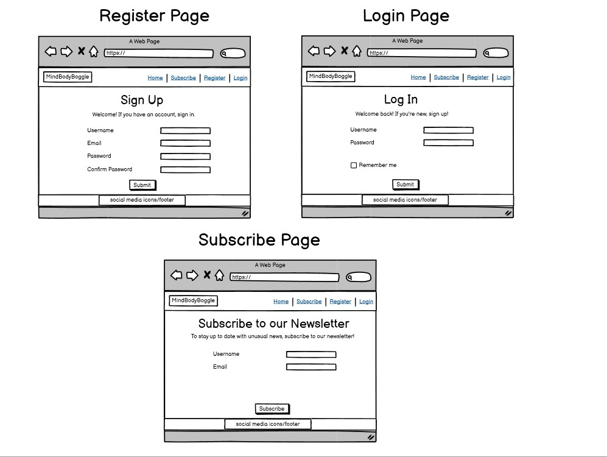
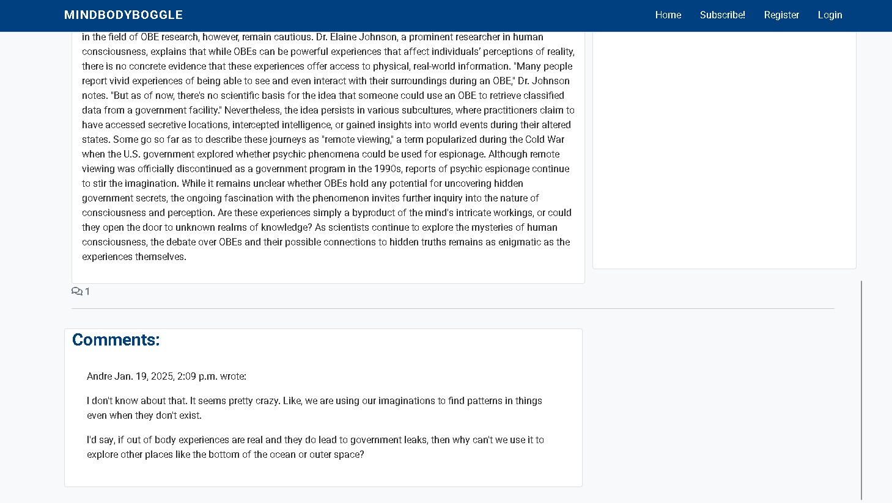
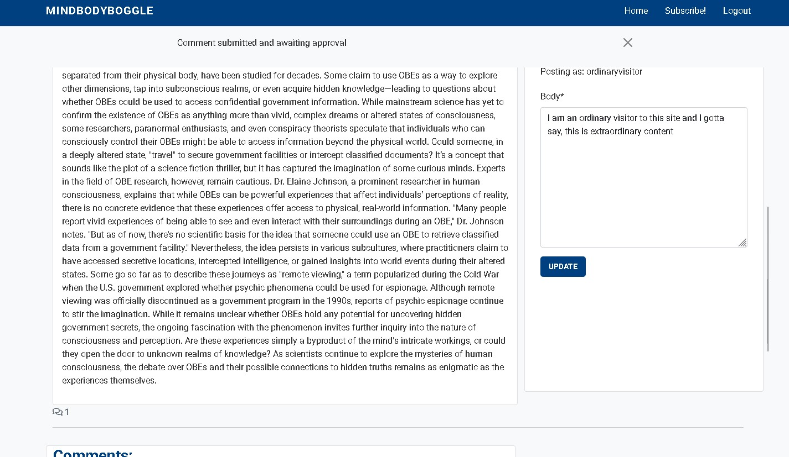
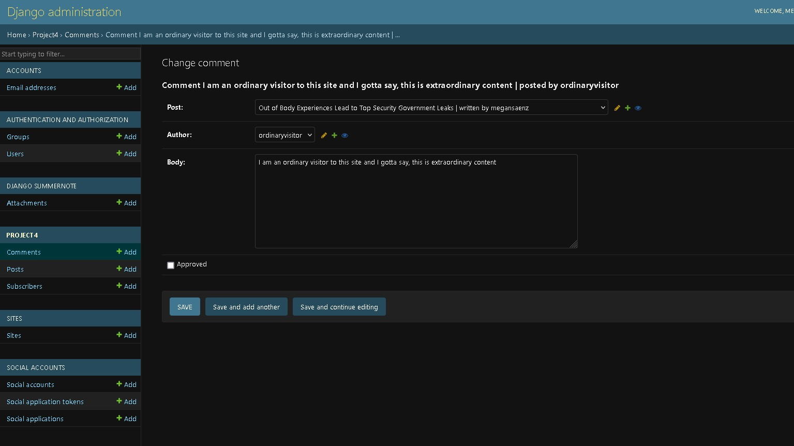

# [ciproject4](https://ci-project4-8ec8d71c1d2a.herokuapp.com)

[](https://www.github.com/MaejorS/ciproject4/commits/main)
[](https://www.github.com/MaejorS/ciproject4/commits/main)
[](https://www.github.com/MaejorS/ciproject4)

## MindBodyBoggle 

This news/blog site is a dynamic, user-focused news-style website that blends wellness insights with the latest trending topics. Built with Django, this platform offers a seamless experience for readers to explore a wide range of articles and for content creators to publish engaging posts. Whether you're interested in health and wellness tips, lifestyle stories, or the latest in current events, MindBodyBoggle has something for everyone.

With integration of Cloudinary for efficient image hosting and a clean, responsive design, MindBodyBoggle ensures that all media, including featured images, are presented beautifully and load quickly. The website also provides an easy-to-navigate interface for users to stay up to date with the latest articles, comment on posts, and explore new content effortlessly.

**Site Mockups**


source: [ciproject4 amiresponsive](https://ui.dev/amiresponsive?url=https://ci-project4-8ec8d71c1d2a.herokuapp.com)

> [!IMPORTANT]
> This project was strongly influenced by the Code Institute walkthrough project called "I Think Therefore I Blog".

## UX

### The 5 Planes of UX

#### 1. Strategy Plane
##### Purpose
- Provide site owners with tools to create, manage, and moderate engaging news content and user interactions.
- Offer users and guests an intuitive platform to explore, engage, and contribute to article discussions.

##### Primary User Needs
- Article owners need seamless tools for publishing and managing posts and comments.
- Registered users need the ability to engage with news content through comments and account features.
- Guests need the ability to browse and enjoy news content without registration.

##### Business Goals
- Foster a dynamic news platform with active user participation.
- Build a sense of community through discussions and user engagement.
- Ensure easy news content management for owners.

#### 2. Scope Plane
##### Features
- A full list of [Features](#features) can be viewed in detail below.

##### Content Requirements
- Article post management in front end or admin panel for access to Cloudinary and styling (create, update, delete, and preview).
- Comment moderation and management tools throught the admin site.
- User account features (register, log in, edit/delete comments).
- Notification system for comment approval status.
- 404 error page for lost users.

#### 3. Structure Plane
##### Information Architecture
- **Navigation Menu**:
  - Links to Home, Article Posts, Login/Register, and Dashboard (for news article owners).
- **Hierarchy**:
  - Article content displayed prominently for easy browsing.
  - Clear call-to-action buttons for account creation and engagement (e.g., commenting).

##### User Flow
1. Guest users browse article content → read posts and see commenter names.
2. Guest users register for an account → log in to leave comments.
3. Registered users leave comments → receive a pending approval notification.
4. Article owners create, update, and manage posts → moderate comments.
5. Article owners approve or reject comments → manage user interactions.

#### 4. Skeleton Plane
##### Wireframe Suggestions
- A list of [Wireframes](#wireframes) can be viewed in detail below.

#### 5. Surface Plane
##### Visual Design Elements
- **[Colours](#colour-scheme)**: see below.
- **[Typography](#typography)**: see below.

### Colour Scheme

A simple pallete for colors was chosen so that the site remained easy to look at by site visitors.

I used [coolors.co](https://coolors.co/080708-3772ff-df2935-fdca40-e6e8e6) to generate my color palette.

- `#000000` primary text.
- `#3772FF` primary highlights.
- `#DF2935` secondary text.
- `#FDCA40` secondary highlights.

### Typography

A simple font was chosen in order to make the site fully accessable and easy to read.

- [Montserrat](https://fonts.google.com/specimen/Montserrat) was used for the primary headers and titles.
- [Lato](https://fonts.google.com/specimen/Lato) was used for all other secondary text.
- [Font Awesome](https://fontawesome.com) icons were used throughout the site, such as the social media icons in the footer.

## User Stories

| Target | Expectation | Outcome |
| --- | --- | --- |
| As a article owner | I would like to create new blog posts with a title, featured image, and content | so that I can share my experiences with my audience. |
| As a article owner | I would like to update existing blog posts | so that I can correct or add new information to my previous stories. |
| As a article owner | I would like to delete blog posts | so that I can remove outdated or irrelevant content from my blog. |
| As a article owner | I would like to retrieve a list of all my published blog posts | so that I can manage them from a central dashboard. |
| As a article owner | I would like to preview a post as draft before publishing it | so that I can ensure formatting and content appear correctly. |
| As a article owner | I would like to review comments before they are published | so that I can filter out spam or inappropriate content. |
| As a article owner | I would like to approve or reject comments from users | so that I can maintain control over the discussion on my posts. |
| As a article owner | I would like to view a list of all comments (both approved and pending) | so that I can manage user engagement effectively. |
| As a article owner | I would like to edit or delete user comments | so that I can clean up or remove inappropriate responses after they've been posted. |
| As a registered user | I would like to log in to the site | so that I can leave comments on blog posts. |
| As a registered user | I would like to register for an account | so that I can become part of the community and engage with the blog. |
| As a registered user | I would like to leave a comment on a blog post | so that I can share my thoughts or ask questions about the owner's experiences. |
| As a registered user | I would like my comment to show my name and the timestamp | so that others can see who I am and when I left the comment. |
| As a registered user | I would like to receive a notification or message saying my comment is pending approval | so that I understand it hasn't been posted immediately. |
| As a registered user | I would like to edit or delete my own comments | so that I can fix mistakes or retract my statement. |
| As a guest user | I would like to read blog posts without registering | so that I can enjoy the content without needing to log in. |
| As a guest user | I would like to browse past posts | so that I can explore the blog's full content history. |
| As a guest user | I would like to register for an account | so that I can participate in the community by leaving comments on posts. |
| As a guest user | I would like to see the names of other commenters on posts | so that I can get a sense of community interaction before registering. |
| As a user | I would like to see a 404 error page if I get lost | so that it's obvious that I've stumbled upon a page that doesn't exist. |

## Wireframes

I've used [Balsamiq](https://balsamiq.com/wireframes) to design my site wireframes.




## Features

### Existing Features

| Feature | Notes | Screenshot |
| --- | --- | --- |
| Register | Authentication is handled by allauth, allowing users to register accounts. |  |
| Login | Authentication is handled by allauth, allowing users to log in to their existing accounts. |  |
| Logout | Authentication is handled by allauth, allowing users to log out of their accounts. |  |
| Article List | The homepage displays basic information about articles, including image, title, author, date, and a brief excerpt. |  |
| View Post | Users can view the full blog post details, including any comments. |  |
| Pagination | Blog posts are displayed in pages, with six posts per page. This provides better navigation for users through the post list. |  |
| Add Comments | Authenticated visitors can comment on blog posts; comments require approval before being published. |  |
| Edit Comments | Authenticated visitors can edit their own comments. |  |
| Delete Comments | Authenticated visitors can delete their own comments. |  |
| Comment Approvals | Admins can approve or disapprove comments submitted by users before they are visible on the blog post. |  |
| Create Post | Site owners can create/publish article posts, including setting a featured image using Cloudinary, all from the Django admin dashboard. |  |
| Update Post | Site owners can update/manage news posts from the Django admin dashboard. |  |
| Delete Post | Site owners can delete news posts from the Django admin dashboard. |  |
| Subscribe Page | The Subscribe page allows users to subscribe to a newsletter. |  |
| Subscriber Requests | Visitors can subscribe to keep updated on news articles requests from the *Subscribe* page, which is later reviewed by the admin. |  |
| User Feedback | Clear and obvious Django messages are used to provide feedback to user actions. |  |
| Heroku Deployment | The site is fully deployed to Heroku, making it accessible online and easy to manage. |  |

### Future Features

- **Post Categories/Tags**: Allow users to categorize and tag blog posts, making it easier for visitors to filter content based on their interests.
- **Post Search Functionality**: Add a search bar for users to quickly find posts by keywords or phrases.
- **Post Likes/Dislikes or Upvotes**: Implement a "like" or "upvote" system for blog posts to encourage user engagement and give feedback to the author.
- **User Profiles**: Create personalized user profiles where authenticated users can view their comments, liked posts, and account information.
- **Comment Replies & Threads**: Enable users to reply to comments, creating nested comment threads for better discussions.
- **Post Sharing**: Add social media sharing buttons (e.g., Twitter, Facebook, LinkedIn) for users to share blog posts.
- **Notifications**: Implement a notification system that alerts users when their comments are approved, when new comments are made on a post they've commented on, or when new posts are published.
- **Post Analytics**: Provide post authors with analytics such as views, time spent reading, and engagement rates.
- **Multilingual Support**: Add the ability to write and view blog posts in multiple languages, broadening the audience.
- **Related Posts Recommendations**: Show related posts at the bottom of a blog post to encourage further reading and keep users engaged.
- **Content Flagging/Reporting**: Allow users to flag or report inappropriate content (comments or posts) for moderation.
- **SEO Optimization**: Implement features for SEO, such as meta tags, custom URLs, and keywords for better search engine ranking.
- **User Dashboard**: Provide users with a dashboard to track their activity, such as comments made, likes received, and blog posts they’ve interacted with.
- **Admin Dashboard Analytics**: Provide site admins with an analytics dashboard showing user activity, popular posts, most commented articles, etc.
- **Custom Themes for Users**: Allow users to customize the visual theme of the site (colors, fonts, etc.) to suit their preferences.

## Tools & Technologies

| Tool / Tech | Use |
| --- | --- |
| [](https://markdown.2bn.dev) | Generate README and TESTING templates. |
| [](https://git-scm.com) | Version control. (`git add`, `git commit`, `git push`) |
| [](https://github.com) | Secure online code storage. |
| [](https://gitpod.io) | Cloud-based IDE for development. |
| [](https://en.wikipedia.org/wiki/HTML) | Main site content and layout. |
| [](https://en.wikipedia.org/wiki/CSS) | Design and layout. |
| [](https://www.javascript.com) | User interaction on the site. |
| [](https://www.python.org) | Back-end programming language. |
| [](https://www.heroku.com) | Hosting the deployed back-end site. |
| [](https://getbootstrap.com) | Front-end CSS framework for modern responsiveness and pre-built components. |
| [](https://www.djangoproject.com) | Python framework for the site. |
| [](https://www.postgresql.org) | Relational database management. |
| [](https://cloudinary.com) | Online static file storage. |
| [](https://whitenoise.readthedocs.io) | Serving static files with Heroku. |
| [](https://balsamiq.com/wireframes) | Creating wireframes. |
| [](https://fontawesome.com) | Icons. |
| [](https://chat.openai.com) | Help debug, troubleshoot, and explain things. |


## Database Design

### Data Model

Entity Relationship Diagrams (ERD) help to visualize database architecture before creating models. Understanding the relationships between different tables can save time later in the project.


I have used `Mermaid` to generate an interactive ERD of my project.


source: [Mermaid](https://mermaid.live/edit#pako:eNqNUsFuwjAM_ZUq5_EDPcI47MCY6LhMlZCbeCVaE1dOAkPAvy-lowyaw3Jynl9ebD8fhSSFIhfIzxpqBlPaLJ51MV9lxz7ujvOsbZ0Fh2zB4CiBBnQzQltwbk-s-sS5tH3wtizeE-Je-2as7JpQj0BJ1qP1N1yBR68NZpIxhmpD9pbUkVwjx8fggxvX_i2R25RYaNWd2NDBbLlYzF9TTVSkDjewImoQbAZty7RD9Y-Chz-K9bSYrV6mSSPS8763ZvjChcpJ1tXDWK7FabcB6fUOHwq47MDpNJnQqbcsz0qxZ-3RlWJMuc6kY0kyJvoz8C7PE7wtJCl_Wu9YQ_0u81QK8SQMchyAint7GU0p_BZj66JjK-CvTvQceRA8FQcrRe454JNgCvVW5J_QuHjr7f3d-wFtwX4QXe_nH0Ix95w)

## Agile Development Process

### Trello Project Board and GitHub Projects

[Trello](https://trello.com/invite/b/675d8e3f82872e4aac5e9913/ATTI29404379188d8338bd28cd749069d82696D598DC/project-4-code-institue) served as an agile tool that helped with tracking the project in a more detail oriented way alongside GitHub Projects [GitHub Projects](https://www.github.com/MaejorS/ciproject4/projects) Through both of these tools, EPICs, User Stories, issues/bugs, and Milestone tasks were planned, then subsequently tracked on a regular basis.


### GitHub Issues

[GitHub Issues](https://www.github.com/MaejorS/ciproject4/issues) served as an another Agile tool. There, I managed my User Stories and Milestone tasks, and tracked any issues/bugs.


## Testing

> [!NOTE]
> For all testing, please refer to the [TESTING.md](TESTING.md) file.

## Deployment

The live deployed application can be found deployed on [Heroku](https://ci-project4-8ec8d71c1d2a.herokuapp.com).

### Heroku Deployment

This project uses [Heroku](https://www.heroku.com), a platform as a service (PaaS) that enables developers to build, run, and operate applications entirely in the cloud.

Deployment steps are as follows, after account setup:

- Select **New** in the top-right corner of your Heroku Dashboard, and select **Create new app** from the dropdown menu.
- Your app name must be unique, and then choose a region closest to you (EU or USA), then finally, click **Create App**.
- From the new app **Settings**, click **Reveal Config Vars**, and set your environment variables to match your private `env.py` file.

> [!IMPORTANT]
> This is a sample only; you would replace the values with your own if cloning/forking my repository.

| Key | Value |
| --- | --- |
| `CLOUDINARY_URL` | user-inserts-own-cloudinary-url |
| `DATABASE_URL` | user-inserts-own-postgres-database-url |
| `DISABLE_COLLECTSTATIC` | 1 (*this is temporary, and can be removed for the final deployment*) |
| `SECRET_KEY` | any-random-secret-key |

Heroku needs some additional files in order to deploy properly.

- [requirements.txt](requirements.txt)
- [Procfile](Procfile)

You can install this project's **[requirements.txt](requirements.txt)** (*where applicable*) using:

- `pip3 install -r requirements.txt`

If you have your own packages that have been installed, then the requirements file needs updated using:

- `pip3 freeze --local > requirements.txt`

The **[Procfile](Procfile)** can be created with the following command:

- `echo web: gunicorn app_name.wsgi > Procfile`
- *replace `app_name` with the name of your primary Django app name; the folder where `settings.py` is located*

For Heroku deployment, follow these steps to connect your own GitHub repository to the newly created app:

Either (*recommended*):

- Select **Automatic Deployment** from the Heroku app.

Or:

- In the Terminal/CLI, connect to Heroku using this command: `heroku login -i`
- Set the remote for Heroku: `heroku git:remote -a app_name` (*replace `app_name` with your app name*)
- After performing the standard Git `add`, `commit`, and `push` to GitHub, you can now type:
	- `git push heroku main`

The project should now be connected and deployed to Heroku!

### PostgreSQL

This project uses a [Code Institute PostgreSQL Database](https://dbs.ci-dbs.net) for the Relational Database with Django.

> [!CAUTION]
> - PostgreSQL databases by Code Institute are only available to CI Students.
> - You must acquire your own PostgreSQL database through some other method if you plan to clone/fork this repository.
> - Code Institute students are allowed a maximum of 8 databases.
> - Databases are subject to deletion after 18 months.

To obtain my own Postgres Database from Code Institute, I followed these steps:

- Submitted my email address to the CI PostgreSQL Database link above.
- An email was sent to me with my new Postgres Database.
- The Database connection string will resemble something like this:
    - `postgres://<db_username>:<db_password>@<db_host_url>/<db_name>`
- You can use the above URL with Django; simply paste it into your `env.py` file and Heroku Config Vars as `DATABASE_URL`.


### Local Development

This project can be cloned or forked in order to make a local copy on your own system.

For either method, you will need to install any applicable packages found within the [requirements.txt](requirements.txt) file.

- `pip3 install -r requirements.txt`.

You will need to create a new file called `env.py` at the root-level, and include the same environment variables listed above from the Heroku deployment steps.

> [!IMPORTANT]
> This is a sample only; you would replace the values with your own if cloning/forking my repository.

Sample `env.py` file:

```python
import os

os.environ.setdefault("SECRET_KEY", "any-random-secret-key")
os.environ.setdefault("DATABASE_URL", "user-inserts-own-postgres-database-url")
os.environ.setdefault("CLOUDINARY_URL", "user-inserts-own-cloudinary-url")  # only if using Cloudinary

# local environment only (do not include these in production/deployment!)
os.environ.setdefault("DEBUG", "True")
```

Once the project is cloned or forked, in order to run it locally, you'll need to follow these steps:

- Start the Django app: `python3 manage.py runserver`
- Stop the app once it's loaded: `CTRL+C` (*Windows/Linux*) or `⌘+C` (*Mac*)
- Make any necessary migrations: `python3 manage.py makemigrations --dry-run` then `python3 manage.py makemigrations`
- Migrate the data to the database: `python3 manage.py migrate --plan` then `python3 manage.py migrate`
- Create a superuser: `python3 manage.py createsuperuser`
- Load fixtures (*if applicable*): `python3 manage.py loaddata file-name.json` (*repeat for each file*)
- Everything should be ready now, so run the Django app again: `python3 manage.py runserver`

If you'd like to backup your database models, use the following command for each model you'd like to create a fixture for:

- `python3 manage.py dumpdata your-model > your-model.json`
- *repeat this action for each model you wish to backup*
- **NOTE**: You should never make a backup of the default *admin* or *users* data with confidential information.

#### Cloning

You can clone the repository by following these steps:

1. Go to the [GitHub repository](https://www.github.com/MaejorS/ciproject4).
2. Locate and click on the green "Code" button at the very top, above the commits and files.
3. Select whether you prefer to clone using "HTTPS", "SSH", or "GitHub CLI", and click the "copy" button to copy the URL to your clipboard.
4. Open "Git Bash" or "Terminal".
5. Change the current working directory to the location where you want the cloned directory.
6. In your IDE Terminal, type the following command to clone the repository:
	- `git clone https://www.github.com/MaejorS/ciproject4.git`
7. Press "Enter" to create your local clone.

Alternatively, if using Gitpod, you can click below to create your own workspace using this repository.

[](https://gitpod.io/#https://www.github.com/MaejorS/ciproject4)

**Please Note**: in order to directly open the project in Gitpod, you should have the browser extension installed. A tutorial on how to do that can be found [here](https://www.gitpod.io/docs/configure/user-settings/browser-extension).

#### Forking

By forking the GitHub Repository, you make a copy of the original repository on our GitHub account to view and/or make changes without affecting the original owner's repository. You can fork this repository by using the following steps:

1. Log in to GitHub and locate the [GitHub Repository](https://www.github.com/MaejorS/ciproject4).
2. At the top of the Repository, just below the "Settings" button on the menu, locate and click the "Fork" Button.
3. Once clicked, you should now have a copy of the original repository in your own GitHub account!

### Local VS Deployment

There are no remaining major differences between the local version when compared to the deployed version online.

## Credits

### Content

| Source | Notes |
| --- | --- |
| [Markdown Builder](https://markdown.2bn.dev) | Help generating Markdown files |
| [Chris Beams](https://chris.beams.io/posts/git-commit) | "How to Write a Git Commit Message" |
| [I Think Therefore I Blog](https://codeinstitute.net) | Code Institute walkthrough project inspiration and lowkey tutor |
| [Bootstrap](https://getbootstrap.com) | Various components / responsive front-end framework |
| [Cloudinary API](https://cloudinary.com) | Cloud storage for static/media files |
| [Whitenoise](https://whitenoise.readthedocs.io) | Static file service |
| [Python Tutor](https://pythontutor.com) | Additional Python help |
| [ChatGPT](https://chatgpt.com) | Help with code logic and explanations. Legit, the realist tutor. |

### Media

| Source | Notes |
| --- | --- |
| [favicon.io](https://favicon.io) | Generating the favicon |
| [Font Awesome](https://fontawesome.com) | Icons used throughout the site |
| [TinyPNG](https://tinypng.com) | Compressing images < 5MB |
| [CompressPNG](https://compresspng.com) | Compressing images > 5MB |

### Acknowledgements

- I would like to thank my Code Institute mentor, [Chris Quinn](https://www.github.com/10xOXR) for the support throughout the development of this project.
- I would like to thank the [Code Institute](https://codeinstitute.net) Tutor Team for their assistance with troubleshooting and debugging some project issues.
- I would like to thank the [Code Institute Slack community](https://code-institute-room.slack.com) for the moral support; it kept me going during periods of self doubt and impostor syndrome.
- I would like to thank my employer, for supporting me in my career development change towards becoming a software developer.
- I would like to thank my family and close friends, an unmatched support system whether near or far, their energy uplifts and inspires.
- I would like to thank The Universe, for always reminding me that anything is possible, that I am exactly where I am meant to be and to always trust the process.

