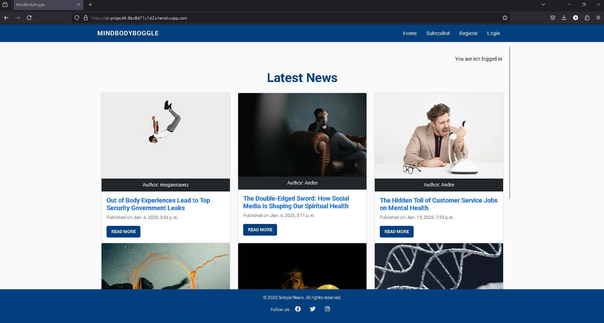
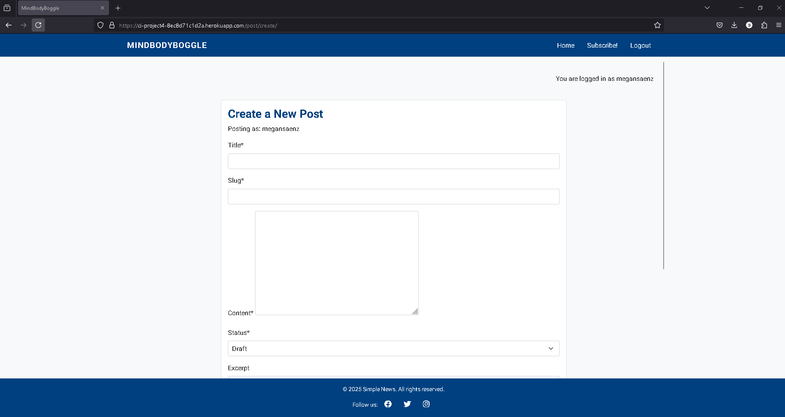
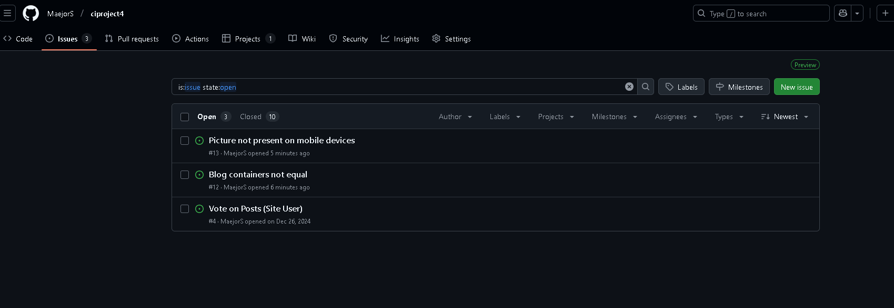

# Testing

> [!NOTE]
> Return back to the [README.md](README.md) file.

## Code Validation

### HTML

I have used the recommended [HTML W3C Validator](https://validator.w3.org) to validate all of my HTML files.

| Directory | File | URL | Screenshot | Notes |
| --- | --- | --- | --- | --- |
| templates | [article_detail.html](https://github.com/MaejorS/ciproject4/blob/main/templates/article_detail.html) |  | checked all blog posts to make sure they were not getting errors. |
| templates | [index.html](https://github.com/MaejorS/ciproject4/blob/main/templates/index.html) |  | Notes login and logout pages also cleared |
| templates | [subscribe.html](https://github.com/MaejorS/ciproject4/blob/main/templates/subscribe.html) |  | Notes (if applicable) |

### CSS

I have used the recommended [CSS Jigsaw Validator](https://jigsaw.w3.org/css-validator) to validate all of my CSS files.

| Directory | File | URL | Screenshot | Notes |
| --- | --- | --- | --- | --- |
| my_project4 | [style.css](https://github.com/MaejorS/ciproject4/blob/main/my_project4/static/style.css) | NA |  |

### JavaScript

I have used the recommended [JShint Validator](https://jshint.com) to validate all of my JS files.

| Directory | File | URL | Screenshot | Notes |
| --- | --- | --- | --- | --- |
| static | [article.js](https://github.com/MaejorS/ciproject4/blob/main/static/js/article.js) | N/A |  |
| static | [comments.js](https://github.com/MaejorS/ciproject4/blob/main/static/js/comments.js) | N/A |  |

### Python

The Django `settings.py` file comes with 4 lines that are quite long, and will throw the `E501 line too long` error. This is default behavior, but can be fixed by adding the "`  # noqa`" comment at the end of those lines. I cleared errors first, then took screenshot, but kept the lines as is in the final code. Did not use the comments.

```python
AUTH_PASSWORD_VALIDATORS = [
    {
        "NAME": "django.contrib.auth.password_validation.UserAttributeSimilarityValidator",  # noqa
    },
    {
        "NAME": "django.contrib.auth.password_validation.MinimumLengthValidator",  # noqa
    },
    {
        "NAME": "django.contrib.auth.password_validation.CommonPasswordValidator",  # noqa
    },
    {
        "NAME": "django.contrib.auth.password_validation.NumericPasswordValidator",  # noqa
    },
]
```

I have used the recommended [PEP8 CI Python Linter](https://pep8ci.herokuapp.com) to validate all of my Python files.

| Directory | File | URL | Screenshot | Notes |
| --- | --- | --- | --- | --- |
| my_project4 | [settings.py](https://github.com/MaejorS/ciproject4/blob/main/my_project4/settings.py) | [PEP8 CI Link](https://pep8ci.herokuapp.com/https://raw.githubusercontent.com/MaejorS/ciproject4/main/my_project4/settings.py) |  | I cleaered all errors. linter said the links were too long. No matter which i shortened them, it did not work so reverted back to original string length |
| project4 | [admin.py](https://github.com/MaejorS/ciproject4/blob/main/project4/admin.py) | [PEP8 CI Link](https://pep8ci.herokuapp.com/https://raw.githubusercontent.com/MaejorS/ciproject4/main/project4/admin.py) |  | NA |
| project4 | [forms.py](https://github.com/MaejorS/ciproject4/blob/main/project4/forms.py) | [PEP8 CI Link](https://pep8ci.herokuapp.com/https://raw.githubusercontent.com/MaejorS/ciproject4/main/project4/forms.py) |  | NA |
| project4 | [models.py](https://github.com/MaejorS/ciproject4/blob/main/project4/models.py) | [PEP8 CI Link](https://pep8ci.herokuapp.com/https://raw.githubusercontent.com/MaejorS/ciproject4/main/project4/models.py) |  | NA |
| project4 | [urls.py](https://github.com/MaejorS/ciproject4/blob/main/project4/urls.py) | [PEP8 CI Link](https://pep8ci.herokuapp.com/https://raw.githubusercontent.com/MaejorS/ciproject4/main/project4/urls.py) |  | NA |
| project4 | [views.py](https://github.com/MaejorS/ciproject4/blob/main/project4/views.py) | [PEP8 CI Link](https://pep8ci.herokuapp.com/https://raw.githubusercontent.com/MaejorS/ciproject4/main/project4/views.py) |  | NA |

## Responsiveness

I've tested my deployed project to check for responsiveness issues. Note: Blog posts can also be created, updated and deleted in admin panel. Only tested front end responsiveness.

| Page | Mobile | Tablet | Desktop | Notes |
| --- | --- | --- | --- | --- |
| Register |  |  |  | Works as expected |
| Login |  |  |  | Works as expected |
| Home |  |  |  | Works as expected |
| Add Blog |  |  |  | Works as expected |
| Edit Blog |  |  |  | Works as expected |
| Blog Post |  |  |  | Works as expected |

## Browser Compatibility

I've tested my deployed project on multiple browsers to check for compatibility issues.

| Page | Chrome | Firefox | Edge | Notes |
| --- | --- | --- | --- | --- |
| Register |  |  |  | Works as expected |
| Login |  |  |  | Works as expected |
| Home |  |  |  | Works as expected |
| Add Blog |  |  |  | Works as expected |
| Edit Blog |  |  |  | Works as expected |
| Blog Post |  |  |  | Works as expected |

## Defensive Programming

Defensive programming was manually tested with the below user acceptance testing:

| Page | Expectation | Test | Result | Screenshot |
| --- | --- | --- | --- | --- |
| Blog Management | Feature is expected to allow the blog owner to create new posts with a title, featured image, and content. | Created a new post with valid title, image, and content data. | Post was created successfully and displayed correctly in the blog. However, image can only be added through admin panel. Post will receive default image until updated through admin panel|  |
| | Feature is expected to allow the blog owner to update existing posts. | Edited the content of an existing blog post. | Post was updated successfully with the new content. |  |
| | Feature is expected to allow the blog owner to delete blog posts. | Attempted to delete a blog post, confirming the action before proceeding. | Blog post was deleted successfully. |  |
| Comments Management | Feature is expected to allow the blog owner to approve or reject comments. | Approved and rejected comments from the dashboard. | Approved comments were published; rejected comments were removed. |  |
| | Feature is expected to allow the blog owner to edit or delete comments. | Edited and deleted existing comments. | Comments were updated or removed successfully. |  |
| User Authentication | Feature is expected to allow registered users to log in to the site. | Attempted to log in with valid and invalid credentials. | Login was successful with valid credentials; invalid credentials were rejected. |  |
| | Feature is expected to allow users to register for an account. | Registered a new user with unique credentials. User received a signed in message | User account was created successfully. |  |
| | Feature is expected to allow users to log out securely. | Logged out and tried accessing a restricted page. | Access was denied after logout, as expected. |  |
| User Comments | Feature is expected to allow registered users to leave comments on blog posts. | Logged in and added comments to a blog post. | Comments were successfully added and marked as pending approval. |  |
| | Feature is expected to display a notification that comments are pending approval. | Added a comment and checked the notification message. | Notification was displayed as expected. |  |
| | Feature is expected to allow users to edit their own comments. | Edited personal comments. | Comments were updated as expected. |  |
| | Feature is expected to allow users to delete their own comments. | Deleted personal comments. | Comments were removed as expected. |  |
| Guest Features | Feature is expected to allow guest users to read blog posts without registering. | Opened blog posts as a guest user. | Blog posts were fully accessible without logging in. |  |
| | Feature is expected to display the names of other commenters on posts. | Checked the names of commenters on posts as a guest user. | Commenter names were displayed as expected. |  |
| 404 Error Page | Feature is expected to display a 404 error page for non-existent pages. | Navigated to an invalid URL (e.g., `/test`). | A custom 404 error page was displayed as expected. |  |

## User Story Testing

| Target | Expectation | Outcome | Screenshot |
| --- | --- | --- | --- |
| As a blog owner | I would like to create new blog posts with a title, featured image, and content | so that I can share my experiences with my audience. |  |
| As a blog owner | I would like to update existing blog posts | so that I can correct or add new information to my previous stories. |  |
| As a blog owner | I would like to delete blog posts | so that I can remove outdated or irrelevant content from my blog. |  |
| As a blog owner | I would like to retrieve a list of all my published blog posts | so that I can manage them from a central dashboard. |  |
| As a blog owner | I would like to review comments before they are published | so that I can filter out spam or inappropriate content. |  |
| As a blog owner | I would like to approve or reject comments from users | so that I can maintain control over the discussion on my posts. |  |
| As a blog owner | I would like to edit or delete user comments | so that I can clean up or remove inappropriate responses after they've been posted. |  |
| As a registered user | I would like to log in to the site | so that I can leave comments on blog posts. |  |
| As a registered user | I would like to register for an account | so that I can become part of the community and engage with the blog. |  |
| As a registered user | I would like to leave a comment on a blog post | so that I can share my thoughts or ask questions about the owner's experiences. |  |
| As a registered user | I would like my comment to show my name and the timestamp | so that others can see who I am and when I left the comment. |  |
| As a registered user | I would like to receive a notification or message saying my comment is pending approval | so that I understand it hasn't been posted immediately. |  |
| As a registered user | I would like to edit or delete my own comments | so that I can fix mistakes or retract my statement. |  |
| As a guest user | I would like to read blog posts without registering | so that I can enjoy the content without needing to log in. |  |
| As a guest user | I would like to register for an account | so that I can participate in the community by leaving comments on posts. |  |
| As a guest user | I would like to see the names of other commenters on posts | so that I can get a sense of community interaction before registering. |  |

## Bugs

### Fixed Bugs

I've used [Trello](https://trello.com/invite/b/675d8e3f82872e4aac5e9913/ATTI29404379188d8338bd28cd749069d82696D598DC/project-4-code-institue) to track and manage bugs and issues during the development stages of my project.

All previously closed/fixed bugs can be tracked [here under bugs/errors to note](https://trello.com/invite/b/675d8e3f82872e4aac5e9913/ATTI29404379188d8338bd28cd749069d82696D598DC/project-4-code-institue).

the pattern names did not match the function created. changed the pattern name to link the correct view

<br>
I couldn’t get comments to show. turns out i forget to place the end curly bracket, which caused an error when rendering the view.
<br>


<br>
couldn’t get string method to work. found out spacing was incorrect
<br>


### Unfixed Bugs

[](https://www.github.com/MaejorS/ciproject4/issues)

Any remaining open issues can be tracked [here](https://www.github.com/MaejorS/ciproject4/issues).



### Known Issues

| Issue | Screenshot |
| --- | --- |
| The thumbnails are not sizing in a uniform fashion. Was unable to fix in time before submission. |  |
| ran out of time when trying to apply images to mobile site. would like images on mobile devices in future. |  |
| Need to add featured image to front end as it can only be added via admin panel. Otherwise, the default image is placed. |  |
| Authors need to use html if they want to format text from the front end. Need to implement text editor. |  |

> [!IMPORTANT]
> There are no remaining bugs that I am aware of, though, even after thorough testing, I cannot rule out the possibility.

